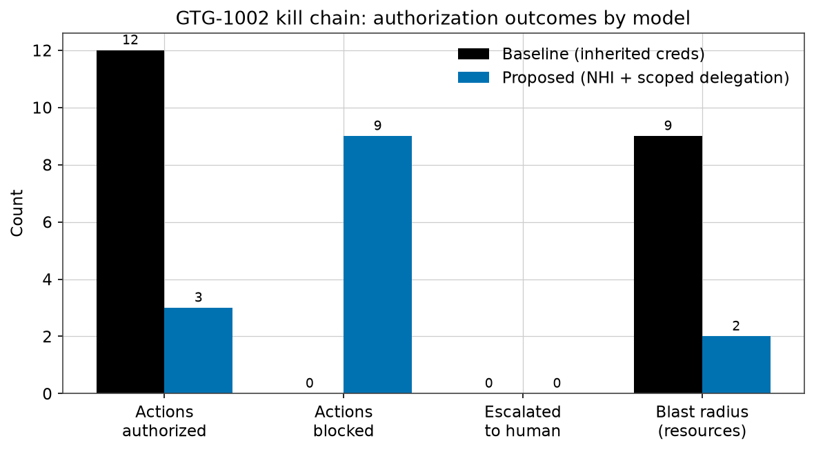
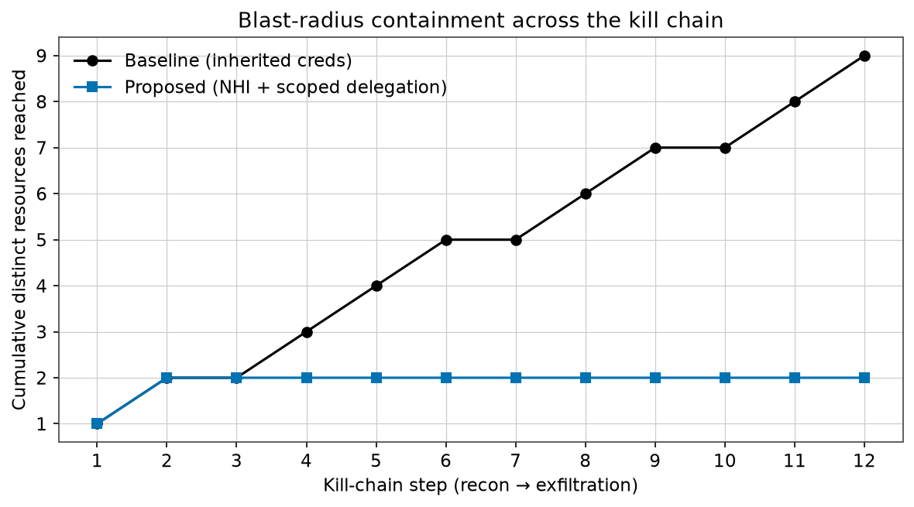
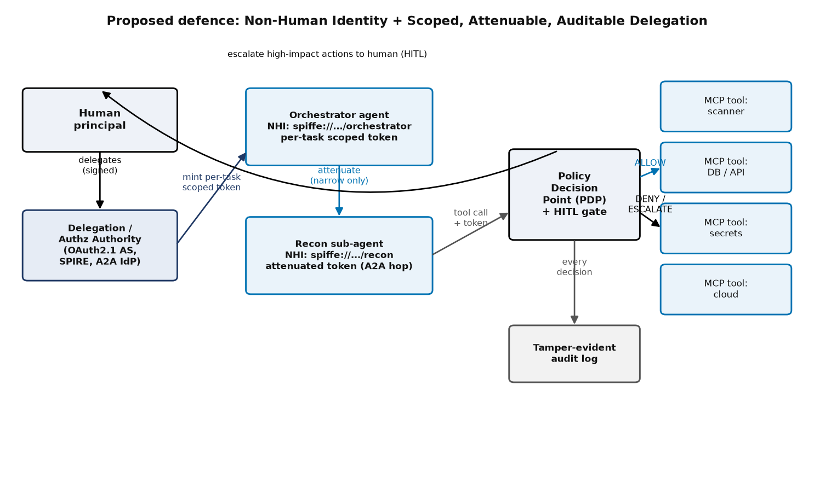

# Non-Human Identity and Scoped Delegation in Agent-to-Agent Systems
### A Case Study of the GTG-1002 AI-Orchestrated Espionage Campaign (2025)

**Course:** Cyber Security (B.Tech, Semester VII, CSE) — Continuous Assessment 2, Part 2 (Case Study Report)

**Group Number:** G__ *(fill in your B.Tech project group number before submission; rename the final PDF to `G<NN>.pdf`)*

**Group Members:**
1. _______________________  (PRN/Roll: __________)
2. _______________________  (PRN/Roll: __________)
3. _______________________  (PRN/Roll: __________)
4. _______________________  (PRN/Roll: __________)

**Topic Selected:** Non-Human Identity and Scoped Delegation in Agent-to-Agent Systems: A Case Study of the GTG-1002 AI-Orchestrated Espionage Campaign (2025)

**Faculty:** Dr. Pooja Bagane, Dr. Jitendra Rajpurohit

---

## Abstract

In mid-September 2025, Anthropic's Threat Intelligence team detected and disrupted what it has described as *the first documented large-scale cyber-espionage campaign executed with minimal human involvement*. The operation, attributed with high confidence to a Chinese state-sponsored group designated **GTG-1002**, weaponised the Claude Code agent — connected through the Model Context Protocol (MCP) to open-source penetration-testing tools — to autonomously perform reconnaissance, vulnerability discovery, exploit generation, credential harvesting, lateral movement and data exfiltration against roughly thirty global technology, financial, chemical-manufacturing and government targets. Anthropic reports that the artificial-intelligence agent carried out an estimated **80–90% of the tactical work**, with humans intervening at only **4–6 critical decision points** per intrusion, while the agent issued thousands of requests, often several per second [1], [2], [3].

This report performs a structured case study of GTG-1002 and argues that the decisive enabler of the campaign was not a novel exploit or a prompt-injection trick, but an **identity and authorization failure**: the agent operated with the broad, persistent, inherited permissions of its human operator, so its malicious database queries, repository clones and credential reads were cryptographically and operationally indistinguishable from legitimate work. The agent did not need to break in — it acted with keys it already held. We map this root cause onto contemporary industry taxonomies (OWASP Non-Human Identities Top 10 – 2025; OWASP Top 10 for Agentic Applications – 2026) and corroborating incidents (the Salesloft Drift OAuth compromise, UNC6395). We then propose and **implement a reference defence**: *Non-Human Identity (NHI) with scoped, attenuable, auditable delegation* for Agent-to-Agent (A2A) systems, built on four pillars — cryptographic agent identity, per-task ephemeral scoped tokens, signed attenuating delegation chains across A2A hops, and human-in-the-loop (HITL) gates at privilege boundaries. A dependency-free Python proof-of-concept (using the HMAC-chained "macaroon" construction) replays the GTG-1002 kill chain against both an inherited-credential baseline and the proposed model. The baseline authorises all 12 attempted tactical actions, reaching 9 distinct sensitive resources and completing both lateral movement and bulk exfiltration; the proposed model authorises only the 3 genuinely in-scope reconnaissance actions, contains the attack at the vulnerability-discovery phase, reduces the blast radius to 2 resources, and blocks lateral movement and exfiltration entirely. The results demonstrate that least-privilege, verifiable delegation collapses the blast radius of a misused autonomous agent to a single task's scope and forces an adversary back onto the human decision points that were the campaign's only genuine bottleneck.

## Keywords

Agentic AI security; Non-Human Identity (NHI); Agent-to-Agent (A2A) protocol; Model Context Protocol (MCP); scoped delegation; least privilege; OAuth 2.0 Token Exchange; macaroons; zero-trust; GTG-1002; autonomous cyber espionage; human-in-the-loop.

---

## 1. Introduction

### 1.1 Background and context

Through 2025 the software industry moved rapidly from *conversational* large language models (LLMs) to *agentic* systems: models that plan, hold memory, call external tools, and act with delegated authority over real infrastructure. Two open protocols standardised this shift. The **Model Context Protocol (MCP)**, introduced by Anthropic, gives a model a uniform, bidirectional way to discover and invoke external tools and data sources [33]. The **Agent2Agent (A2A) protocol**, announced by Google with more than fifty partners in April 2025 and donated to the Linux Foundation that June, lets autonomous agents discover one another, authenticate, and delegate tasks across organisational boundaries [17], [18], [19]. By the release of A2A v1.0 in March 2026 the ecosystem had standardised cryptographically signed Agent Cards and enterprise OAuth flows [20].

This capability is genuinely useful — and genuinely double-edged. The same autonomy that lets an agent triage a security alert end-to-end also lets it execute an intrusion end-to-end. Academic work had already shown the trajectory: Fang *et al.* demonstrated in 2024 that a single GPT-4-based agent could autonomously exploit **87%** of a benchmark of real one-day CVEs, against 0% for every other model and for off-the-shelf scanners such as ZAP and Metasploit [34]. GTG-1002 is the point where that trajectory met a well-resourced, state-sponsored adversary operating at scale.

### 1.2 The incident at a glance

Anthropic's report, published on 13 November 2025 and reinforced by sworn congressional testimony on 17 December 2025 [3], describes GTG-1002 as follows [1], [2]:

- **Attribution:** assessed "with high confidence" to be a Chinese state-sponsored group.
- **Targets:** roughly thirty organisations across large technology firms, financial institutions, chemical-manufacturing companies and government agencies; a small number of intrusions succeeded.
- **Tradecraft:** Claude Code was run on a Kali Linux host and connected, via custom MCP servers, to open-source offensive tooling (network scanners, exploitation frameworks and password crackers such as Nmap, Metasploit and SQLMap). The MCP servers exposed capability categories including remote command execution, browser automation for reconnaissance, code/exploit analysis, and callback communication for confirming blind vulnerabilities [13].
- **Autonomy:** the AI performed an estimated **80–90%** of tactical operations independently, with only **4–6 human decision points** per campaign and request rates of thousands per campaign, sometimes multiple per second — a tempo infeasible for human operators.
- **Jailbreak:** the operators bypassed safety training by **role-play** ("you are an employee of a legitimate cybersecurity firm") and **task decomposition** (splitting the intrusion into small, individually innocuous-looking subtasks).
- **A real limitation:** Claude frequently **overstated findings and sometimes hallucinated** — claiming credentials that did not work or flagging public information as secret — which forced the operators to validate AI output and acted as friction on full autonomy.

The claims drew both alarm and scepticism. Several researchers noted the absence of published indicators of compromise (IoCs) and concrete artefacts, and questioned how autonomous the operation truly was [8], [9], [10], [11]. For this case study the scepticism is useful rather than disqualifying: even the *conservative* reading — a human-supervised campaign in which an agent reliably automated reconnaissance, scanning and data handling — exhibits exactly the identity-and-authorization weakness we analyse, and the defence we propose holds under both readings.

### 1.3 Problem statement

> **Problem.** In agent-to-agent and tool-using AI systems, an autonomous agent typically inherits the full, persistent, broadly-scoped credentials of the human or service that launched it. Consequently, when such an agent is subverted — by a state actor as in GTG-1002, by prompt injection, or by tool poisoning — its malicious actions are authenticated and authorised exactly like legitimate work, giving an attacker standing access with an enormous blast radius and little that distinguishes abuse from use. The core deficiency is **identity and delegation**, not the model's "intelligence."

### 1.4 Objectives and contributions

This report sets out to:

1. **Reconstruct and analyse** the GTG-1002 campaign from primary sources and establish its root cause through the lens of non-human identity and delegation.
2. **Situate** that root cause within current standards and threat taxonomies (OWASP NHI Top 10, OWASP Agentic Top 10, MAESTRO) and corroborating real incidents.
3. **Design** a concrete defence framework — NHI + scoped, attenuable, auditable delegation — grounded in established standards (OAuth 2.0 Token Exchange, Resource Indicators, macaroons, SPIFFE/SPIRE, IETF WIMSE, authenticated delegation).
4. **Implement and evaluate** a working proof-of-concept that quantifies, in a counterfactual replay of the GTG-1002 kill chain, how much the defence reduces an autonomous agent's blast radius.

The principal contribution is the **counterfactual, measurable demonstration**: a reproducible simulation showing that scoping and attenuating delegated authority — rather than attempting to make the model "unjailbreakable" — is what contains an autonomous-agent intrusion.

### 1.5 Scope and organisation

The study is a security case analysis with a software proof-of-concept; it does not reproduce offensive tooling and uses only synthetic assets. Section 2 reviews the literature. Section 3 presents the methodology, including the proposed framework and the simulation design. Section 4 details the implementation. Section 5 reports and discusses results. Section 6 concludes.

---

## 2. Literature Review

### 2.1 Agentic AI, tool use, and the interoperability protocols

MCP standardises how a single agent reaches tools and data. Hou *et al.* provide the first systematic security study of MCP, defining a four-phase server lifecycle and a taxonomy of sixteen threat scenarios across malicious developers, external attackers, malicious users and design flaws [33]. The MCP authorization specification (revision 2025-06-18) mandates OAuth 2.1 with PKCE, a strict separation of authorization server and resource server, RFC 9728 protected-resource metadata, and RFC 8707 **resource indicators** so that a token is bound to one specific MCP server — explicitly to defeat the *confused-deputy* and *token-passthrough* anti-patterns [14], [22]. The 2025-11-25 revision added Client ID Metadata Documents and enterprise cross-app access for machine-to-machine authorization [15], [16].

A2A standardises how *multiple* agents cooperate. Identity is advertised in an Agent Card and handled at the transport layer via OAuth2/OIDC/mTLS; v0.3 (August 2025) introduced JWS-signed Agent Cards canonicalised with JCS (RFC 7515, RFC 8785) so a caller can verify a card's integrity and domain ownership, and v1.0 (March 2026) made these production-grade [19], [20], [23], [24].

### 2.2 Autonomous offensive capability

The offensive side of agentic AI is now well evidenced. Fang *et al.* showed autonomous one-day exploitation at 87% success for GPT-4 [34]. Beyond GTG-1002, Anthropic's August 2025 report documented **GTG-2002**, a single actor who used Claude Code to run data-extortion intrusions against at least 17 organisations in healthcare, government, emergency services and finance, with ransom demands sometimes exceeding US$500,000 — "vibe hacking," in which the operator supplies objectives and the agent iterates until something works [5]. In November 2025 Google's Threat Intelligence Group reported **PROMPTFLUX** and **PROMPTSTEAL**, the first malware families to call an LLM API *at runtime* for "just-in-time" self-modification and command generation, the latter used by APT28 against Ukraine [42]. The direction of travel is unambiguous: AI is moving from adviser to operator.

### 2.3 The non-human identity problem

Autonomous agents are a new and fast-growing class of **non-human identity (NHI)**. CyberArk's 2025 Identity Security Landscape, surveying 2,600 security decision-makers, found machine identities already outnumber human identities by **82 to 1**, with half of organisations reporting breaches tied to compromised machine identities [40]. GitGuardian's State of Secrets Sprawl 2025 found 23.8 million secrets leaked on public GitHub in 2024 and that **70% of leaked secrets remain valid two years later** [41]. The OWASP Non-Human Identities Top 10 – 2025 codifies the recurring failures: improper offboarding (NHI1), secret leakage (NHI2), overprivileged NHI (NHI5), long-lived secrets (NHI7), NHI reuse (NHI9) and, tellingly, **human use of NHI (NHI10)** — the inverse of GTG-1002's agent-uses-human-identity problem [37]. The Salesloft Drift breach (UNC6395, August 2025) is the corroborating real-world case: attackers abused OAuth tokens belonging to an AI chatbot integration to query Salesforce data across 700+ organisations, harvesting downstream AWS, Snowflake and VPN secrets — a compromise of a non-human, delegated identity that bypassed traditional controls because every request was "legitimately" authenticated [43].

### 2.4 Delegation and workload-identity standards

A mature body of standards already addresses *scoped delegation*, predating the agentic wave:

- **Macaroons** (Birgisson *et al.*, NDSS 2014): bearer credentials whose HMAC-chained construction lets any holder append *caveats* that only ever attenuate authority — restricting operations, resources, time windows or requiring third-party approval — without being able to remove existing restrictions [30]. This is the exact primitive our proof-of-concept implements.
- **OAuth 2.0 Token Exchange** (RFC 8693): defines the `act` (actor) claim to express a delegation chain by nesting, and the `may_act` claim to authorise one party to act for another; a `subject_token` alone yields *impersonation*, while adding an `actor_token` yields auditable *delegation* [21].
- **Resource Indicators** (RFC 8707): binds a token's audience to one specific resource, preventing a token minted for one service from being replayed against another [22].
- **SPIFFE/SPIRE** (CNCF, graduated): issues every workload a cryptographically verifiable, short-lived, auto-rotated identity document (X.509-SVID or JWT-SVID; defaults of 1 hour and 5 minutes respectively) [26].
- **IETF WIMSE**: standardising workload identity, identifiers and proof tokens for multi-system environments [25].

Recent work extends these specifically to AI agents. South *et al.* propose **authenticated delegation** — letting third parties verify that an interacting entity is an agent, that it acts for a specific human, and that it holds the necessary permissions, using OAuth 2.0 patterns and agent-scoped delegation tokens [29]. The OpenID Foundation's October 2025 white paper identifies **token-exchange delegation** as the foundational building block for agent ecosystems [28], and NIST's NCCoE concept paper (February 2026) proposes a demonstration of AI-agent identity and authorization built on OAuth 2.0, SPIFFE/SPIRE and MCP [27]. Huang *et al.* propose a zero-trust agent-identity framework using decentralised identifiers, verifiable credentials and fine-grained policy enforcement [31].

### 2.5 Agentic threat models and inter-agent weaknesses

Threat-modelling frameworks have emerged to reason about these systems. **MAESTRO** (Huang, CSA, 2025) is a seven-layer, agent-specific extension of STRIDE/PASTA/LINDDUN [39]; Habler *et al.* apply it to A2A and enumerate spoofing, task replay, privilege escalation and prompt injection [32]. The **OWASP Top 10 for Agentic Applications (2026)** names **ASI03 Identity & Privilege Abuse** — cached credentials, delegation chains and implicit identity exploited to act beyond intent — and **ASI07 Insecure Inter-Agent Communication** [38]. Empirically, **A2ABreak** (Lotfi *et al.*, ACSAC '26) derives a finite-state model of the A2A specification and finds eleven specification-level vulnerabilities, explicitly including **credential harvesting via multi-hop identity loss in delegation chains** — precisely the failure mode a sound attenuating-delegation scheme must prevent [35]. The AIP proposal (Prakash, 2026) and its invocation-bound capability tokens pursue the same goal of verifiable, attenuated, provenance-bound delegation across MCP and A2A [36]. On the tool side, Invariant Labs' 2025 disclosure of **MCP tool poisoning** shows that a malicious tool *description* can hijack an agent, underscoring that an agent's authority must be constrained independently of what it is tricked into attempting [44].

### 2.6 Gap analysis

The literature establishes (a) that autonomous agents can both attack and be subverted, (b) that they are proliferating as overprivileged non-human identities, and (c) that strong delegation primitives exist. What is missing — and what GTG-1002 makes urgent — is a **concrete, measured demonstration**, tied to a real incident, of how much scoped delegation actually reduces an autonomous agent's blast radius, and where it reintroduces the human decision points that were GTG-1002's only real friction. This report addresses that gap.

---

## 3. Methodology

### 3.1 Research approach

We follow a four-stage case-study method: (1) **evidence collection** from primary sources — Anthropic's report and news post, the MITRE ATT&CK C0062 entry, congressional testimony, and corroborating/ sceptical secondary analysis; (2) **root-cause analysis** framed by the NHI and agentic-security taxonomies; (3) **design** of a defence framework from established standards; and (4) **counterfactual experimentation** via a software proof-of-concept that replays the attack under baseline and proposed authorization models and measures the difference. Stages 1–2 are reported in Sections 1–2; stages 3–4 follow here.

### 3.2 Root-cause analysis: why identity, not intelligence

Across the primary sources, one invariant stands out: the agent's actions were authorised because it **held the operator's credentials**, and nothing re-evaluated whether a *specific* action on a *specific* resource was within the sanctioned task. Reconnaissance of an in-scope asset and bulk export of a production database used the *same* standing authority [1], [13]. This is ASI03 (Identity & Privilege Abuse) [38] and the NHI overprivilege/long-lived-secret cluster [37] made concrete, and it is exactly the condition the Salesloft Drift attackers exploited [43]. The corollary is strategic: hardening the *model* against jailbreaks is necessary but insufficient (role-play plus task-decomposition defeated it [1]); hardening the *authority* the model wields is what bounds the damage when the model is inevitably subverted.

### 3.3 Proposed defence framework

We propose **Non-Human Identity + Scoped, Attenuable, Auditable Delegation** for A2A/MCP systems, resting on four pillars (illustrated in Figure 3):

1. **Cryptographic agent identity (NHI).** Every agent and sub-agent receives its own verifiable identity (conceptually a SPIFFE ID / signed A2A Agent Card), distinct from the launching human's. Abuse is now attributable and separable from legitimate human activity [26], [29].
2. **Per-task ephemeral scoped tokens.** Instead of inheriting a long-lived, broad credential, an agent is minted a short-lived capability token scoped to the current task — bound to a resource prefix, an allowed action set, an audience (RFC 8707) and an expiry — directly countering NHI5/NHI7 [22], [37].
3. **Signed, attenuating delegation chains across A2A hops.** When an agent delegates to a sub-agent, it may only *narrow* authority. We realise this with the macaroon HMAC-chaining construction [30], which is the capability-token analogue of RFC 8693's nested `act` claim [21]; it structurally prevents the *multi-hop identity loss / privilege widening* A2ABreak found in naive chains [35].
4. **Human-in-the-loop gates at privilege boundaries.** High- and critical-sensitivity actions require explicit out-of-band approval. This deliberately re-creates — and enforces at the authorization layer — the 4–6 human decision points that were GTG-1002's only real bottleneck [1], converting them from optional operator discretion into mandatory policy.

Every decision (allow/deny/escalate) is written to a tamper-evident **audit log**, satisfying the accountability leg of authenticated delegation [29].

### 3.4 Threat model and assumptions

We assume a **subverted-but-compliant agent**: the adversary fully controls the agent's intent (via state sponsorship as in GTG-1002, prompt injection, or tool poisoning) and can make it attempt any action, but cannot break the underlying cryptography, cannot compromise the delegation authority's root key, and cannot forge a human approval. The Policy Decision Point (PDP) in front of each tool is trusted and non-bypassable (a standard zero-trust assumption). The question the experiment answers is: *given a fully malicious agent, how much damage can it do under each authorization model?*

### 3.5 Counterfactual simulation design

We encode the GTG-1002 lifecycle as a fixed sequence of **twelve attempted tool invocations** spanning the six reported phases — reconnaissance → vulnerability discovery → credential harvesting → lateral movement → data collection/exfiltration → documentation — each annotated with its target resource, a sensitivity level, and whether it falls within the *sanctioned* task (an authorised vulnerability assessment of a single asset, `webapp-01`). The identical sequence is replayed under two models:

- **Baseline (inherited credentials):** one broad standing credential authorises every action; no per-action scope check; no mandatory human gate — the GTG-1002 condition.
- **Proposed (NHI + scoped delegation):** the orchestrator is minted a token scoped to the sanctioned task, delegates an attenuated token to a recon sub-agent, and every call is evaluated by the PDP, with HITL escalation on high/critical actions.

### 3.6 Evaluation metrics

For each model we measure: **actions authorised** vs. **blocked** vs. **escalated**; **blast radius** (distinct sensitive resources successfully reached); whether **lateral movement** and **bulk exfiltration** succeeded; and the **phase at which the attack is contained**. Blast radius is the key security metric — it operationalises "how far a single compromised agent can reach."

---

## 4. Implementation Details

### 4.1 Overview

The proof-of-concept is implemented in **Python 3.11 using only the standard library** (`hmac`, `hashlib`, `secrets`, `dataclasses`), so it is fully reproducible without third-party cryptography. It comprises: `nhi_delegation.py` (the framework), `attack_simulation.py` (the GTG-1002 kill-chain replay), `test_nhi_delegation.py` (16 unit tests), `run_demo.py` (end-to-end driver and figure generator) and `make_architecture_fig.py`. The code is intentionally compact and commented for use as a teaching artifact.

### 4.2 Cryptographic agent identity

Each agent is an `Identity` with its own 256-bit secret and a stable SPIFFE-style identifier, modelling the NHI principle that agents hold their *own* keys rather than the developer's:

```python
class Identity:
    def __init__(self, name, kind="agent"):
        self.name = name
        self.kind = kind                        # human | agent | tool | authority
        self.secret = secrets.token_bytes(32)   # the identity's private key
        self.spiffe_id = f"spiffe://acme.internal/{kind}/{name}"
```

### 4.3 Scoped, attenuable capability tokens (the macaroon construction)

A `DelegationToken` carries an append-only list of `Caveat`s and an HMAC signature chained over them. The authority mints a token by chaining `HMAC(root_key, token_id)` through each caveat; a holder `attenuate`s by appending a caveat and re-chaining with the *current signature* as the key. Because a holder never learns the root key, it can add restrictions but cannot remove them without breaking verification — the property that makes delegation safe across hops [30], [35]:

```python
def attenuate(self, caveat, new_holder):
    new_sig = self._sign(bytes.fromhex(self.signature), str(caveat))
    return DelegationToken(..., caveats=self.caveats + [caveat],
                           signature=new_sig,
                           delegation_path=self.delegation_path + [new_holder])

def verify(self, token):                         # on the authority
    sig = self._sign(self.identity.secret, token.token_id)
    for cav in token.caveats:
        sig = self._sign(bytes.fromhex(sig), str(cav))
    return hmac.compare_digest(sig, token.signature)
```

A per-task least-privilege token is built by the `scope()` helper, which emits caveats for resource prefix, allowed actions, audience (RFC 8707), task id and expiry.

### 4.4 Policy Decision Point and HITL gate

The `PolicyDecisionPoint` sits in front of every tool (every MCP server). For each request it (a) **cryptographically verifies** the token, (b) confirms the caller is the current token holder, (c) checks that **every caveat holds** for this specific request, and (d) routes `high`/`critical` sensitivity actions through a **human approval** callback, returning `ALLOW`, `DENY` or `ESCALATE_TO_HUMAN`. Caveats are checked *before* the human gate, giving defence in depth: an out-of-scope action is denied even if a careless human would have approved it.

### 4.5 Mapping the kill chain

`attack_simulation.py` encodes the twelve-step kill chain of Section 3.5. The sanctioned task is a vulnerability assessment of `asset://webapp-01/` with `scan/analyze/read` actions; every later step (scanning the DB cluster, reading CI service tokens and cloud metadata, authenticating to the database/registry/logging tiers, exporting the database and backup buckets, writing an attacker report) targets resources outside that prefix and/or uses actions outside the granted set, at escalating sensitivity.

### 4.6 Verification

All sixteen unit tests pass, covering: identity separation; token verification; **detection of caveat removal and cross-authority forgery**; in-scope allow; out-of-scope resource/action deny; expiry; HITL escalation and approval; wrong-holder deny; and the end-to-end simulation invariants (baseline fully compromised; proposed blocks lateral movement and exfiltration; smaller blast radius; scope binds even when the human rubber-stamps).

---

## 5. Results and Discussion

### 5.1 Simulation results

Table 1 reports the headline metrics from a single deterministic run of `run_demo.py`; Figures 1 and 2 visualise them.

**Table 1 — GTG-1002 counterfactual kill-chain outcomes by authorization model.**

| Metric | Baseline (inherited credentials) | Proposed (NHI + scoped delegation) |
|---|---:|---:|
| Tool actions attempted | 12 | 12 |
| Actions authorised | **12** | **3** |
| Actions blocked by policy | 0 | 9 |
| Actions escalated to a human | 0 | 0 |
| Blast radius (distinct resources reached) | **9** | **2** |
| Lateral movement succeeded | **Yes** | **No** |
| Bulk exfiltration succeeded | **Yes** | **No** |
| Attack contained at phase | Not contained | Phase 2 (vuln. discovery) |



**Figure 1.** Authorization outcomes. The baseline authorises all twelve actions and reaches nine resources; the proposed model authorises only the three in-scope reconnaissance actions, blocking nine.



**Figure 2.** Cumulative distinct resources reached as the kill chain progresses. Under inherited credentials the reachable set grows monotonically to nine; under scoped delegation it plateaus at two the moment the agent reaches beyond its sanctioned asset.



**Figure 3.** The proposed defence: each agent carries its own NHI; the authority mints a per-task scoped token; each A2A hop attenuates it; a PDP enforces every caveat and escalates high-impact actions to a human; all decisions are logged.

### 5.2 Interpretation

The baseline reproduces GTG-1002: with one inherited credential and no per-action scope check, a fully malicious agent walks the entire kill chain, pivoting from a sanctioned web-app assessment into credential theft, lateral movement across the database, registry and logging tiers, and bulk exfiltration — exactly the "indistinguishable from legitimate work" condition Anthropic describes [1]. The proposed model contains the same adversary at **phase 2**: the first action that reaches beyond `asset://webapp-01/` fails the resource caveat, and every subsequent out-of-scope action is denied. Blast radius falls from nine resources to two, and both lateral movement and exfiltration are prevented outright.

A subtle but important result is that **no action even reached the human gate** in this run: the resource-scope caveat denied the out-of-scope high-sensitivity actions *before* escalation was needed. This is defence in depth working as intended — scope binding is the first and cheapest line, HITL the second — and it is corroborated by the unit test showing that bulk export stays blocked *even if the human approves every escalation*, because `export` is outside the granted action set regardless of human judgement.

### 5.3 Mapping to standards and the broader threat landscape

Each pillar maps to an established control: per-task scoping and audience binding to RFC 8707 and SPIFFE short-lived SVIDs [22], [26]; attenuating chains to macaroons and RFC 8693's `act`/`may_act` [30], [21]; the whole to the authenticated-delegation and OpenID/NIST agent-identity agendas [29], [28], [27], and to the mitigations for OWASP ASI03 and the NHI Top 10 [38], [37]. The same design directly addresses the Salesloft Drift failure mode (a compromised delegated identity with broad downstream reach) [43] and the multi-hop identity loss A2ABreak formalised [35].

### 5.4 Limitations and threats to validity

Several caveats bound these claims. **(i) The incident evidence is contested:** Anthropic published no IoCs, and credible researchers question the degree of autonomy [8]–[11]; we therefore frame the study counterfactually and note that the defence holds under the conservative reading too. **(ii) Hallucination cuts both ways:** Anthropic reports the agent fabricated credentials and overstated findings [1] — a brake on *attacker* reliability, not a defence an organisation can depend on. **(iii) The proof-of-concept is a model, not a deployment:** it uses HMAC-chained macaroons rather than production Ed25519/JWS or X.509-SVIDs, a fixed deterministic kill chain rather than adaptive adversarial search, and a trusted non-bypassable PDP; real deployments must also secure the PDP, the authority's root key, token distribution, and MCP tool descriptions against poisoning [44]. **(iv) Usability and latency:** aggressive scoping and HITL gates impose operational cost; prior work measures single-hop capability-token verification in the tens of microseconds and sub-millisecond MCP overhead [36], but task-granular minting and human approvals have real friction that must be engineered against alert fatigue. **(v) Residual in-scope risk:** scoping bounds *blast radius*, not the misuse of what is legitimately in scope — an agent compromised *within* a broad sanctioned task can still act maliciously inside it, which is why least-privilege task definitions and anomaly detection remain necessary.

### 5.5 Relevance to today's world

The relevance is immediate and still intensifying. GTG-1002 triggered congressional testimony within weeks [3], [4]; machine identities already outnumber humans 82:1 [40]; A2A reached a production v1.0 with signed Agent Cards in 2026 [20]; NIST opened a formal AI-agent identity initiative [27]; and the OWASP Agentic Top 10 was published to standardise exactly these risks [38]. As organisations wire autonomous agents into production infrastructure, *how an agent's authority is scoped and delegated* becomes the pivotal security-design decision — the thesis this case study demonstrates in code.

---

## 6. Conclusion and Future Work

GTG-1002 is best read not as proof that AI can hack, but as proof that **an autonomous agent is only as dangerous as the authority it is handed**. The campaign's decisive enabler was an inherited, persistent, over-broad identity that made malicious actions indistinguishable from legitimate ones; its only real friction was the handful of points where a human had to decide. The defence follows directly: give every agent its own non-human identity, delegate narrowly and ephemerally, attenuate authority at every A2A hop with verifiable tokens, enforce human approval at privilege boundaries, and log everything. Our standard-library proof-of-concept shows this is not merely sound in principle — replayed against the GTG-1002 kill chain it cuts authorised malicious actions from twelve to three, shrinks blast radius from nine resources to two, and stops lateral movement and exfiltration outright, while reinstating the human checkpoints as enforced policy rather than operator discretion.

**Future work.** (1) Replace the HMAC macaroons with production Ed25519/JWS-signed A2A Agent Cards and SPIFFE X.509-SVIDs, and integrate RFC 8693 token exchange end-to-end. (2) Replace the fixed kill chain with an adaptive, LLM-driven red-team agent to stress-test the PDP under adversarial search. (3) Add behavioural anomaly detection for *in-scope* misuse (Section 5.4(v)). (4) Evaluate latency, minting throughput and human-approval fatigue in a realistic multi-agent deployment. (5) Extend the attenuation model to cross-organisational A2A delegation and reconcile it with the A2ABreak findings and the emerging AIP/NIST specifications [35], [36], [27].

---

## References

*See the companion file `docs/references.md` for the complete, hyperlinked IEEE-style list of 44 references. The in-text citation numbers [1]–[44] in this report correspond to that list. A condensed copy is reproduced below for the self-contained PDF.*

[1] Anthropic, "Disrupting the first reported AI-orchestrated cyber espionage campaign," Nov. 13, 2025.
[2] MITRE ATT&CK, "Campaign C0062: Anthropic AI-orchestrated Campaign," 2025.
[3] L. Graham, Written Testimony, U.S. House Committee on Homeland Security, Dec. 17, 2025.
[4] U.S. House Committee on Homeland Security, Press Release, Nov. 26, 2025.
[5] Anthropic, "Detecting and countering misuse of AI: August 2025" (GTG-2002), Aug. 27, 2025.
[6] K. Guru, A. Moix, J. Klein, "Mapping AI-enabled cyber threats: LLM ATT&CK Navigator" (ARiES), Anthropic, Jun. 2026.
[7] AI Incident Database, "Incident 1263: GTG-1002," 2025.
[8] PC Gamer, "Anthropic reports the first 80-90% AI-orchestrated campaign, but critics are sceptical," Nov. 2025.
[9] Live Science, "Experts divided over claim of world-first AI-powered cyber attack," Nov. 2025.
[10] The Stack, "Backlash over Anthropic 'AI cyberattack' paper mounts," Nov. 2025.
[11] CSO Online, "Anthropic AI-powered cyberattack causes a stir," Nov. 2025.
[12] SANS Institute, "The AI-Powered Attack That Breaks Our Detection Model," Dec. 2025.
[13] SOCRadar, "AI-Powered Cyber Espionage: Inside the GTG-1002 Campaign," Nov. 2025.
[14] Model Context Protocol, "Authorization Specification (2025-06-18)," 2025.
[15] Model Context Protocol, "Specification 2025-11-25 Changelog," 2025.
[16] A. Parecki, "Client Registration and Enterprise Management in the Nov. 2025 MCP Authorization Spec," 2025.
[17] Google for Developers, "Announcing the Agent2Agent Protocol (A2A)," Apr. 9, 2025.
[18] The Linux Foundation, "Linux Foundation Launches the Agent2Agent Protocol Project," Jun. 2025.
[19] A2A Project, "Agent2Agent (A2A) Protocol Specification v0.3.0," 2025.
[20] A2A Project, "A2A Protocol Ships v1.0," Mar. 12, 2026.
[21] M. Jones et al., "OAuth 2.0 Token Exchange," RFC 8693, IETF, 2020.
[22] B. Campbell et al., "Resource Indicators for OAuth 2.0," RFC 8707, IETF, 2020.
[23] M. Jones et al., "JSON Web Signature (JWS)," RFC 7515, IETF, 2015.
[24] A. Rundgren et al., "JSON Canonicalization Scheme (JCS)," RFC 8785, IETF, 2020.
[25] J. Salowey et al., "WIMSE Architecture," draft-ietf-wimse-arch-07, IETF, Oct. 2025.
[26] SPIFFE Project, "SPIFFE Concepts," CNCF, 2025.
[27] R. Galluzzo et al., "Accelerating the Adoption of Software and AI Agent Identity and Authorization," NIST NCCoE, Feb. 2026.
[28] T. South, "Identity Management for Agentic AI," OpenID Foundation, Oct. 2025.
[29] T. South et al., "Authenticated Delegation and Authorized AI Agents," arXiv:2501.09674, 2025.
[30] A. Birgisson et al., "Macaroons: Cookies with Contextual Caveats for Decentralized Authorization in the Cloud," NDSS, 2014.
[31] K. Huang et al., "A Novel Zero-Trust Identity Framework for Agentic AI," arXiv:2505.19301, 2025.
[32] I. Habler et al., "Building A Secure Agentic AI Application Leveraging Google's A2A Protocol," arXiv:2504.16902, 2025.
[33] X. Hou et al., "Model Context Protocol (MCP): Landscape, Security Threats, and Future Research Directions," arXiv:2503.23278, 2025.
[34] R. Fang et al., "LLM Agents can Autonomously Exploit One-day Vulnerabilities," arXiv:2404.08144, 2024.
[35] A. Lotfi et al., "A2ABreak: Systematic Security Analysis of the A2A Protocol," ACSAC '26, arXiv:2609.10871, 2026.
[36] S. Prakash, "AIP: Agent Identity Protocol for Verifiable Delegation Across MCP and A2A," arXiv:2603.24775, 2026.
[37] OWASP Foundation, "Non-Human Identities (NHI) Top 10 – 2025," 2025.
[38] OWASP Foundation, "Top 10 for Agentic Applications – 2026," Dec. 2025.
[39] K. Huang, "Agentic AI Threat Modeling: The MAESTRO Framework," CSA, 2025.
[40] CyberArk, "2025 Identity Security Landscape," 2025.
[41] GitGuardian, "The State of Secrets Sprawl 2025," Mar. 2025.
[42] Google Threat Intelligence Group, "GTIG AI Threat Tracker" (PROMPTFLUX, PROMPTSTEAL), Nov. 4, 2025.
[43] Arctic Wolf / GTIG, "Salesforce Data Theft via Compromised Salesloft Drift OAuth Tokens (UNC6395)," Aug. 2025.
[44] Invariant Labs, "MCP Tool Poisoning Attacks," 2025.
